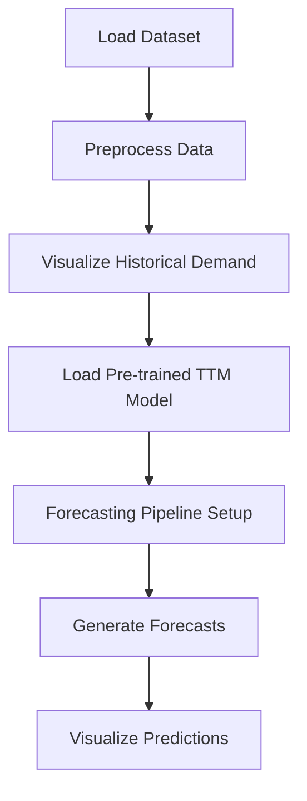

<h1 align="center">⚡ Granite Energy Forecasting ⚡</h1>
<p align="center">
  Time series forecasting of Spain’s hourly electricity demand using IBM Granite TinyTimeMixer (TTM) models with Hugging Face datasets and visualization.
</p>

<p align="center">
  <a href="https://colab.research.google.com/drive/1uzY7cEri-pxx9fka9x0iATPSzPSVOlMr?usp=sharing" target="_blank">
    
  </a>
</p>

---

## 📑 Table of Contents
1. [Introduction](#-introduction)
2. [Problem Statement](#-problem-statement)
3. [Approach & Solution](#-approach--solution)
4. [Workflow](#-workflow)
5. [How to Run](#-how-to-run)
6. [Step-by-Step Breakdown](#-step-by-step-breakdown)
7. [Key Insights](#-key-insights)
8. [Skills You’ll Learn](#-skills-youll-learn)

---

## 🔹 Introduction
Forecasting in time series analysis enables data scientists to identify historical patterns and generate predictions about the future.  
This project leverages **IBM’s Granite Time Series Foundation Models (TSFM)** and **TinyTimeMixers (TTM)** — compact pre-trained models for multivariate time-series forecasting.

- TTM models have **<1M parameters** yet outperform larger models in zero/few-shot forecasting.
- Lightweight, efficient, and fine-tunable for multivariate tasks.
- Uses `granite-tsfm` utilities for building forecasting pipelines.

Dataset: **Spain’s hourly electricity consumption (Hugging Face dataset).**

---

## 🔹 Problem Statement
The goal is to **predict future electricity demand** based on historical data.  
Energy consumption shows **cyclical & seasonal patterns (daily/weekly usage)**, making forecasting essential for:
- Grid management
- Load balancing
- Resource allocation

---

## 🔹 Approach & Solution
1. **Install Dependencies** – Setup environment with Granite TSFM.  
2. **Import Libraries** – Load data handling, modeling, and visualization tools.  
3. **Load Dataset** – Spain’s hourly consumption dataset.  
4. **Data Preparation** – Clean, preprocess, and select context length.  
5. **Visualization** – Inspect historical demand.  
6. **Model Setup** – Load IBM pre-trained TTM.  
7. **Forecasting Pipeline** – Configure and generate predictions.  
8. **Visualization** – Compare real vs forecasted demand.  

---

## 🔹 Workflow


## 🔹 How to Run

# 1. Clone the Repository
git clone https://github.com/your-username/Granite-energy-forecasting.git
cd Granite-energy-forecasting

# 2. Create Environment & Install Dependencies
pip install "granite-tsfm[notebooks]==0.2.23"
pip install matplotlib pandas torch

# 3. Run in Google Colab
# 👉 Click the badge in README to launch directly in Colab with pre-installed dependencies.


# 🔹 Step-by-Step Breakdown

# 1. Install the TSFM Library
```
!pip install "granite-tsfm[notebooks]==0.2.23"

```

# 2. Import Packages (Python)
```
import matplotlib.pyplot as plt
import pandas as pd
import torch

from tsfm_public import (
    TimeSeriesForecastingPipeline,
    TinyTimeMixerForPrediction,
)
from tsfm_public.toolkit.visualization import plot_predictions
```

# 3. Dataset Path (Python)
```
DATA_FILE_PATH = "hf://datasets/vitaliy-sharandin/energy-consumption-hourly-spain/energy_dataset.csv"
```

# 4. Define Time & Target Variables (Python)
```
timestamp_column = "time"
target_columns = ["total load actual"]
context_length = 512
```

# 5. Load & Prepare Data (Python)
```
input_df = pd.read_csv(DATA_FILE_PATH, parse_dates=[timestamp_column])
input_df = input_df.ffill()
input_df = input_df.iloc[-context_length:,]
input_df.tail()
```

# 6. Plot Target Series (Python)
```
fig, axs = plt.subplots(len(target_columns), 1, figsize=(10, 2 * len(target_columns)), squeeze=False)
for ax, target_column in zip(axs, target_columns):
    ax[0].plot(input_df[timestamp_column], input_df[target_column])
```

# 7. Load Pre-trained Model (Python)
```
zeroshot_model = TinyTimeMixerForPrediction.from_pretrained(
    "ibm-granite/granite-timeseries-ttm-r2",
    num_input_channels=len(target_columns),
)
```

# 8. Forecasting Pipeline (Python)
```
device = "cuda" if torch.cuda.is_available() else "cpu"

pipeline = TimeSeriesForecastingPipeline(
    zeroshot_model,
    timestamp_column=timestamp_column,
    id_columns=[],
    target_columns=target_columns,
    explode_forecasts=False,
    freq="h",
    device=device,
)

zeroshot_forecast = pipeline(input_df)
zeroshot_forecast.tail()
```

# 9. Plot Predictions (Python)
```
plot_predictions(
    input_df=input_df,
    predictions_df=zeroshot_forecast,
    freq="h",
    timestamp_column=timestamp_column,
    channel=target_columns[0],
    indices=[-1],
    num_plots=1,
)
```

# 🔹 Key Insights
# - Granite TTMs are lightweight & efficient yet powerful.
# - Support zero-shot predictions without fine-tuning.
# - End-to-end pipeline: Data → Model → Forecast → Visualization.


# 🔹 Skills You’ll Learn

✅ Time series forecasting with pre-trained foundation models

✅ Handling & preprocessing real-world datasets

✅ Building forecasting pipelines with Hugging Face assets

✅ Visualization of time series trends & forecasts

